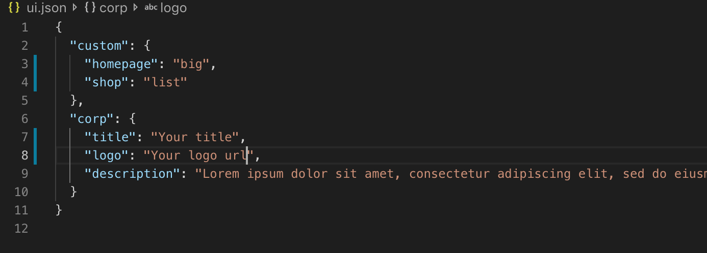

Web Jamstack project
======================
First mini-project of Web Pool, Epitech (MSc) Lyon, 2019

## Table of content

- [Set up the shop]
    - [Add items to the shop](#add-items-to-the-shop)
    - [Choose your theme](#choose-your-theme)
- [Customization](#customization)
- [Payment]    
- [Run the site](#page-setup)
  

## Set up the shop

### Add items to the shop
The easy way to add some items to the shop is by using a MySQL database.

You have to edit the file gatsby-config.js and fill the fields with your database information. 
The queries information is related to your database query. See the example below.

## Customization
The file ui.json define your own informations and the display you choose. Fill the "corp" fields with your name, logo, description...
Next, you have to choose one skin for the homepage, and another one for the shop list.
For homepage, values are "big" or "small"
For shop, values are "list" or "block"

### Choose your theme
    WIP

